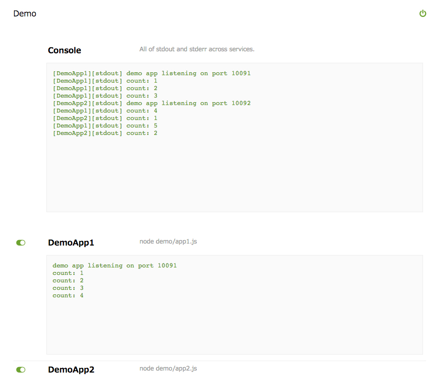

# Quick PM

Quick API for your service development.

This is for early stage of your complex service development, 
works well with service not yet daemonized. (in other words, works well while you are playing with console log)


## Usage

``` 
$ npm install quick-pm
$ quick-pm service.hjson
``` 

## API

``` 
/api/status?name=<name>  : get status for <name> (get all w/o name)
/api/console             : get merged stdout/stderr across all services
/api/stdout?name=<name>  : get stdout for <name>
/api/stderr?name=<name>  : get stderr for <name>
/api/start?name=<name>   : start <name>
/api/stop?name=<name>    : stop <name>
/api/restart?name=<name> : restart <name>
/api/startall            : start all
/api/stopall             : stop all
/api/config              : get config
``` 

## UI

Write your own interface you like.
But this module includes default web UI.


## Demo



There are two demo app in the demo directory, that writing out counter value to the stdout every sec. 
Try `$ quick-pm demo/app.hjson` and go to `http://127.0.0.1:10088/web/default/index.html`.
You can test this tool.


## License

MIT

